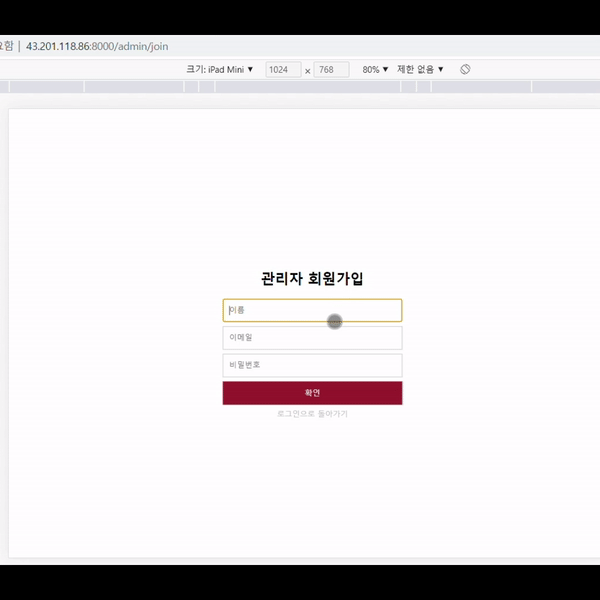

# KJIPizza
## 스프링부트를 활용한 객체지향적인 설계 추구
### 프로젝트 소개
* 위 프로젝트는 실생활에서 쉽게 접할수 있는 키오스크를 만들기 위한 프로젝트로 프론트(Web)과 백엔드(Java ,Spring Boot) 영역을 분담하여 프로젝트를 진행하였습니다.
* Spring boot 중점적으로 개발하였으며 Spring Security,Validation 등을 활용하였습니다.
* 제작 기간은 3주 정도 소요됐으며, 구성원은 다음과 같습니다.

### 목차

* 기능 소개

<a href = "https://github.com/syw1114"> 서 영우 (메인페이지, 장바구니, 매출관리 View 및 백엔드)) </a>

<a href = "https://github.com/kwak-daeun"> 곽 다은 (관리자 View, 상품등록 기능, 결제내역 조회기능)) </a>

<a href = "https://github.com/hajaeryul"> 하 재률(메인 페이지 View, 로그인 기능, 회원가입 기능, 결제 기능)) </a>

### 기능 소개

매장 관리위해 기본적인 CRUD기능을 구현하였습니다. 어플리케이션의 모든 기능을 설명하지 않고 가장 핵심적인 기능 위주로 설명 하겠습니다.

#### 1. 로그인 및 회원가입 기능

```
    @Override
    public void join(JoinReqDto joinReqDto) throws Exception {

        Admin admin = joinReqDto.toEntity();

        int result = accountRepository.saveAdmin(admin);

        if(result == 0) {
            throw new CustomInternalServerErrorException("회원가입중 문제 발생");
        }
    }

```
 서비스계층의 join 메서드의 경우 JoinReqDto라는 추상클래스를 매겨변수로 받고 있습니다. 
joinReqDto는 유효성 검사를 하는 클래스입니다. 
키오스크 회원가입의 경우 관리자 회원가입영역만 존재하여 Entity가 Dto로 변환돼서 데이터베이스에 저장되는 방식으로 처리하였습니다.

```
    @Data
    public class JoinReqDto {
        @NotBlank(message = "이름을 입력하세요", groups = ValidationGroups.NotBlankGroup.class)
        @Size(min = 1, max = 4, message = "이름은 4글자까지 입력 가능합니다", groups = ValidationGroups.SizeGroup.class)
        @Pattern(regexp = "^[가-힇]{2,5}$", message = "한글만 입력하세요", groups = ValidationGroups.PatternCheckGroup.class)
        private String name;
        @NotBlank(message = "이메일을 입력하세요", groups = ValidationGroups.NotBlankGroup.class)
        @Email
        private String email;
        @NotBlank(message = "비밀번호를 입력하세요", groups = ValidationGroups.NotBlankGroup.class)
        @Size(min = 8, max = 16, message = "비밀번호는 8 ~ 16자 입력 가능합니다", groups = ValidationGroups.SizeGroup.class)
        @Pattern(regexp = "^(?=.*[a-zA-Z])(?=.*\\d)(?=.*[~!@#$%^&*_])[a-zA-Z\\d-~!@#$%^&*_]*$", message = "비밀번호는 특수기호, 영문, 숫자를 모두 포함해야합니다",             groups = ValidationGroups.PatternCheckGroup.class)
        private String password;

        public Admin toEntity() {
            return Admin.builder()
                    .name(name)
                    .password(new BCryptPasswordEncoder().encode(password))
                    .email(email)
                    .build();
        }
    }
```



#### 2. 장바구니 기능
 
 클라이언트에 따라 자신이 담고싶은 제품을 담아 장바구니에 해당 제품을 조회할 수 있도록 구현하였습니다.
해당 제품에 해당하는 버튼을 이용하여 수량을 증가,감소 할 수 있으며 새로고침을 한 경우에는 키오스크의 특성에 맞게 장바구니에 제품들의 정보가 남지않도록 하였습니다.

서비스 계층의 postCarList메서드의 경우에는 각각의 테이블에서 장바구니에 담겨져있는 제품을 주문하였을경우
해당 테이블에서 어떤 제품을 주문하였는지 또한 제품에대한 추가 옵션이 있는지 체크하여 데이터베이스에 저장하는 방식으로 처리하였습니다.
장바구니에는 여러개의 제품을 담을수 있어서 장바구니Entity를 List로 가져왔습니다.

```
    @Override
    public void postCartList(List<OrderOptionReqDto> orderOptionReqDto) throws Exception {
    
        Order order = new Order();
        // 몇번 테이블에서 어떤 제품을 주문했는지 DB에 저정하기 위해 order에 테이블의 정보를 저장합니다.
        List<OrderDtl> orderDtl = new ArrayList<OrderDtl>();

        List<OrderOption> orderOption = new ArrayList<OrderOption>();
        for (int i = 0; i < orderOptionReqDto.size(); i++) {
            if (i == 0) {
                order = orderOptionReqDto.get(i).toOrderEntity();
                productRepository.postTable(order);
                // order에 담긴 기본키인 id를 OrderDtl의 order_id에 저장.
            }
            orderDtl = orderOptionReqDto.get(i).toOrderList(order.getId());
            productRepository.postOrderDtl(orderDtl);
            AtomicInteger result = new AtomicInteger();
            orderDtl.forEach(item -> {
                result.set(item.getId());
                System.out.println(result.get());
            });
            
            //제품이 피자인경우에는 추가 옵션이 존재하므로 추가옵션의 갯수만큼 toOrderOption 메소드 실행.
            if (orderOptionReqDto.get(i).getProductOptionList().size() > 0) {
            // 추가옵션이 존재하는 제품의 기본키인 id를 받아 toOrderOption(result.get()) 실행.
            productRepository.postOrderOption(orderOptionReqDto.get(i).toOrderOption(result.get()));
            }
        }
    }
```

```
    @Data
    @Builder
    @NoArgsConstructor
    @AllArgsConstructor

    public class OrderOptionReqDto {

        private int orderMstId;
        private int tableNumber;
        private int productId;
        private int stockValue;
        private int optionId;
        private List <Map<String, Object>> productOptionList;
        private int amount;
        public Order toOrderEntity() {
            return Order.builder()
                    .table_id(tableNumber)
                    .amount(amount)
                    .build();
        }

        public List<OrderDtl> toOrderList(int mstId) {
            List<OrderDtl> orderDtls = new ArrayList<OrderDtl>();

            orderDtls.add(OrderDtl.builder()
                    .order_id(mstId)
                    .pdt_id(productId)
                    .stock(stockValue)
                    .build());

            return orderDtls;
        }

        public List<OrderOption> toOrderOption(int dtlId){
            List<OrderOption> orderOptions = new ArrayList<>();

            for(Map<String,Object> data : productOptionList){
                orderOptions.add(OrderOption.builder()
                        .order_dtl_id(dtlId)
                        .option_id((Integer)data.get("optionId")).build());
            }

            return orderOptions;
        }
    }

```


 
 
